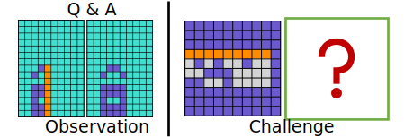

# PQA: Perceptual Question Answering
This is the official implementation (PyTorch) of PQA: Perceptual Question Answering https://arxiv.org/abs/2104.03589

Given an ex-emplar PQA pair (Left), a new question (right) is required to be addressed, i.e. generate answer-grid from scratch.

Please check the <a href="https://qugank.github.io/pqa.github.io/" target="_blank">project page</a> for more details.

Bibtex: 

    @inproceedings{yonggang2021pqa,
        title={PQA: Perceptual Question Answering},
        author={Yonggang Qi, Kai Zhang, Aneeshan Sain, Yi-Zhe Song},
        booktitle={CVPR},
        year={2021}
    }